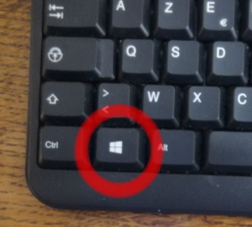
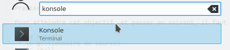
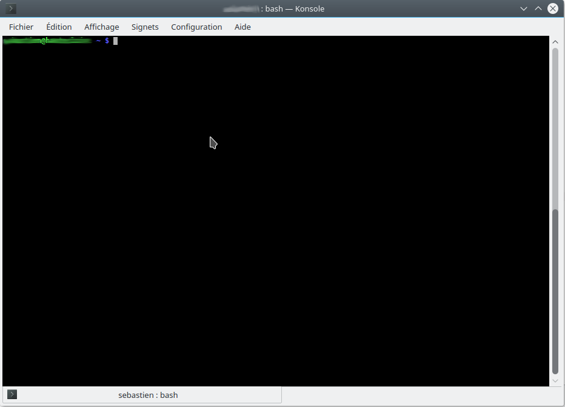

# Cours de programmation

## À ceux qui veulent suivrent le cours.

### À propos

Ce cours vous apprendra a fabriquer un logiciel.
Afin de rester simple, ce cours prendra des raccourcis.

Si certaines instructions paraissent obscures il ne faut pas rester bloqué dessus et essayer d'avancer quand même.

### leçon 1 -- installation

#### Pré-requis

 * Savoir lire.
 * Savoir copier/coller
 * Connaitre la `touche Entrée`

#### Objectif

Premier objectif installer ce cours sur son ordinateur.

Pour atteindre cet objectif, et passer au suivant, il faut connaitre 3 outils :
 
 * la console
 * le gestionnaire de sources
 * le shell

#### La console

La console est un outil pour communiquer avec l'ordinateur.
On y tape des commandes et l'ordinateur les exécutes.

Une fois les commandes exécutées par l'ordinateur, celui-ci affiche, dans la console, le résultat de ces commandes.

La console permet d'échanger avec l'ordinateur comme si on parlait sa langue et qu'on lui écrivait. D'une certaine façon.

La console que nous utiliserons s'appelle `konsole`. C'est pas très original comme nom mais on s'en fiche en vrai.

Pour ouvrir `konsole` il faut utiliser la `touche menu` du clavier.

Puis il faut taper `konsole` ce qui recherchera l'application dans le menu.

Après cela il suffit de cliquer sur l'icône de `Konsole` pour le lancer (ou juste d'appuyer sur la `touche Entrée`).

La fenêtre de l'application `Konsole` s'ouvre.

Pour entrer dedans il suffit de cliquer au milieu.

Une fois dedans on peut taper des commandes.

#### Les commandes

Les commandes sont des ordres que l'on donne à l'ordinateur.

Voici les commandes que nous allons utiliser :

 * ls
 * pwd
 * cd
 * mkdir
 * git
 * bash

Certaines de ces commandes s'utilisent telles quelles, d'autres on besoin d'informations supplémentaires. On appelle ces informations des paramètres.

Par exemple vous pouvez taper : `ls` puis la `touche Entrée`.

Cela affiche la liste des fichiers présents dans le répertoire courant.

#### Les répertoires

Nous verrons, dans le détail, ce qu'est un répertoire plus tard. Pour l'instant il suffit de savoir que c'est un emplacement.

Quand on ouvre `Konsole` le répertoire de départ est appelé `home`.

La commande `cd` permet de changer de répertoire. Elle prend en paramètre le répertoire de destination.
Si elle est utilisée sans paramètre elle permet de se déplacer dans le `home`.

La commande `mkdir` permet de créer un répertoire. Nous allons l'utiliser pour créer le répertoire de nos leçons.

Dans la `Konsole` tapez `mkdir lecons` (sans la céddille) puis appuyez la `touche Entrée`.
Vous venez de créer le répertoire `lecons`.

En tapant à nouveau `ls` puis la `touche Entrée` vous le voyez apparitre dans la liste.

En tapant `cd lecons` puis la `touche Entrée` vous vous deplacez dans le répertoire `lecons`.

En tapant encre `ls` puis la `touche Entrée` vous voyez la liste des fichiers dans `lecons`, cela ne devrait donc rien afficher car `lecons` est vide.

C'est ici que nous allons installer l'ensemble des leçons grâce à la commande `git`

#### Git

Git est un outil pour développer. C'est un outil complexe qui est utiliser pour plein de choses. Nous allons l'utiliser sans chercher tout comprendre au début.

Il permet, entre autre, de :

 * télécharger les fichiers des logiciels en cours de fabrication
 * sauvegarder les logiciels en cours de fabrication
 * faciliter le travil à plusieurs
 * pleins d'autres choses essentielles à la fabrication de logiciels complexes

Pour installer les leçons il suffit de taper la commande :
`git clone git@github.com:bl0bmaster/lecon-dev-grand-debutant.git`

Cette commande fait ce que l'on appel "cloner un dépôt". Le "dépôt" c'est la version en ligne des leçons. Le "clone" c'est la version dans votre ordinateur des leçons.

Pour aller dans le répertoire du clone il suffit de taper la commande `cd lecon-dev-grand-debutant`. (n'oubliez pas la `touche Entrée`).
Vous pouvez aussi taper la commande `ls` pour voir le contenu de ce répertoire.
Cela devrait afficher

    img  REAMDE.md  suivant
    
Vous venez d'installer **votre** environnement pour les leçons.

Pour passer à la leçon suivante, il faut taper la commande `bash suivant`. (n'oubliez pas la `touche Entrée`).

### leçon 1 -- fin de la leçon

Pour passer à la leçon suivante il faut dans le répertoire du clone

Il n'est pas nécessaire de lire le chapitre suivant, cette leçon est terminée.

## À ceux qui veulent le mettre en place 

### Cible du cours

Ce cours est destiné à de grand débutant, de tout âge, sachant lire.
On y apprend à faire une application web.

La partie serveur est en Python3. Le front est en Vue.js.
Et oui c'est ambitieux.

### Pré-requis

Il faut être sous Linux/KDE et avoir firefox, bash, kate, git, nvm, python3 et pip3 déjà installés sur la machine.
